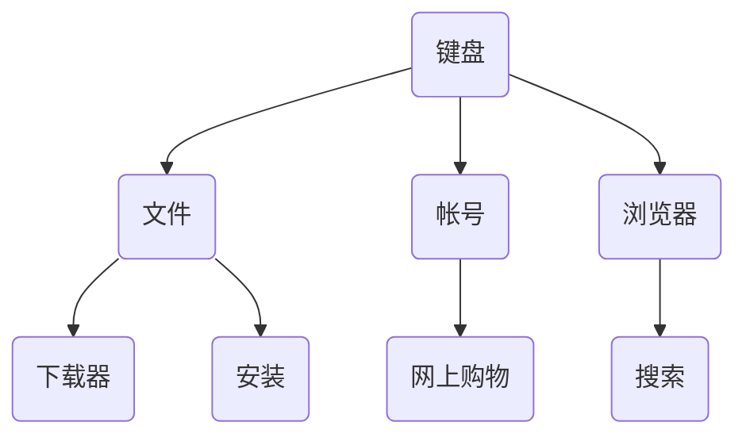

## 技能树

<!--

:material-web:{ .browser }
:material-download:{ .downloader }
:material-file:{ .file }
:material-package-variant-plus:{ .install }
:material-keyboard:{ .keyboard }
:material-search-web:{ .search }
:material-shopping:{ .shopping }
:material-package-variant-plus:{ .user_account }

-->

## 技能清单

:material-web: [浏览器](./browser.md)
{ .card .skill_browser }

:material-download: [下载器](./downloader.md)
{ .card .skill_downloader }

:material-file: [文件](./file.md)
{ .card .skill_file }

:material-package-variant-plus: [安装](./install.md)
{ .card .skill_install }

:material-keyboard: [键盘](./keyboard.md)
{ .card .skill_keyboard }

:material-search-web: [搜索](./search.md)
{ .card .skill_search }

:material-shopping: [网上购物](./shopping.md)
{ .card .skill_shopping }

:material-account: [帐号](./user_account.md)
{ .card .skill_user_account }

