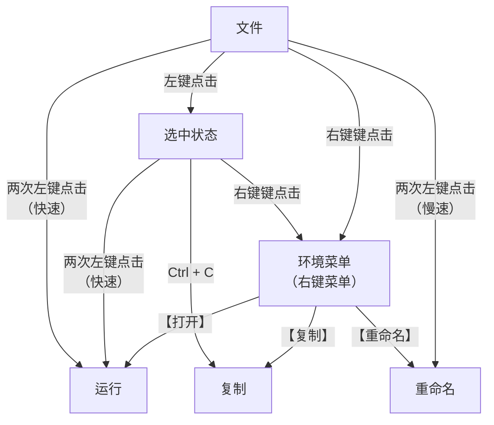

## 简介

本指南，将会介绍使用鼠标所需的技能。

## 技能等级

### 初级

认识标准鼠标的五个按键，分别是左键、右键、中间、上滚轮和下滚轮，然后选择适合的握法、指法。

#### 鼠标按键

鼠标有很明显且巨大的「左键」与「右键」。(1) 然后是中间的滚轮，手指向上滑动会触发「上滚轮」，向下滑动会触发「下滚轮」。
最后按下滚轮，就是「中键」。
{: .annotate }

1.  通常左键是主要按键，而右键是次要按键，不过可以在设置里更改。

#### 握法

鼠标的握持手法有多种，分别是：[^20304][^14705][^60757]

[^20304]: Redragon, [Understanding Mouse Grip Styles: Fingertip vs. Palm vs. Claw](https://redragonshop.com/blogs/community/understanding-mouse-grip-styles-fingertip-vs-palm-vs-claw), Redragonshop, 2023-11-24. (参照 2024-07-08).

[^14705]: [Fingertip vs. Palm vs. Claw](https://www.corsair.com/us/en/explorer/gamer/mice/mouse-grips-explained-fingertip-vs-palm-vs-claw/), CORSAIR:EXPLORER. (参照 2024-07-08).

[^60757]: Dominik Schmalzried, Patrick Schmalzried, [Optimal grip for a gaming mouse](https://zaunkoenig.co/blog/optimal-grip-for-a-gaming-mouse), Welcome to Zaunkoenig, 2019-01-31. (参照 2024-07-08).

1.  <ruby>趴握<rt>palm grip</rt></ruby>

    手掌、手指贴在鼠标上。优点是稳定性和舒适度。

2.  <ruby>抓握<rt>claw grip</rt></ruby>

    手掌贴在鼠标上，指尖接触按钮，手指其他部分悬空。平衡了趴握与指握的优缺点。

3.  <ruby>指握<rt>fingertip grip</rt></ruby>（捏握）

    仅有指尖接触按钮，手掌和其他手指部分悬空。优点是精确性和灵活性。

鼠标的握法也与鼠标的形状有一些关系，比如 Apple 的 Magic Mouse 鼠标非常扁平，不适合趴握。而一些较重的鼠标，
可能不适合指握。

握持鼠标的手部出现疼痛、红肿等情况，俗称的「鼠标手」，其实就是重复性劳损。不同的握法，对手部造成的影响也有不同。
风险从低到高，分别是：趴握 < 抓握 < 指握，因为手对鼠标的接触面越小，就越需要使用力量控制鼠标，这会使腕管压力过大，
最终导致重复性劳损。[^35045]

[^35045]: pivotalphysio, [Repetitive Wrist Strain Injury in Gaming](https://pivotalphysio.com/repetitive-wrist-strain-injury-in-gaming/), Pivotal Physio, 2018-06-08. (参照 2024-07-08).

曾有游戏直播主表示，握持鼠标的手很痛，所以很长时间都不再用鼠标玩游戏，期间只能玩手柄游戏。所以，为了能健康持续使用电脑，
最好握持方式选择轻松的，这样能缓解手部疲劳。

垂直鼠标或人体工学鼠标，也许能缓解「鼠标手」，具体可以查询相关资料。[^htham]

[^htham]: [How to Hold a Mouse: 3 Grips](https://juniperoffice.com/blogs/blog/how-to-hold-a-mouse-3-grips), Juniper Office, 2022-07-21. (参照 2024-07-08).

#### 指法

常见的鼠标指法有：

1.  食指左键与滚轮，中指右键。[^wh]
2.  食指左键，中指滚轮与右键。（推荐）
3.  食指左键，中指滚轮，无名指右键。（推荐）

[^wh]: [wikiHow](https://www.wikihow.com/Use-a-Computer-Mouse) 提到的方法。

> [!note]+ 鼠标指法差异
>
> 像交叉筷、「二指禅键盘指法」一样，物品的使用方法，没有唯一正确的方法，只要满足使用者基础的功能，那就是正确的。
> 但是不同的使用方法，会有一些性能差异，比如二指禅在打字速度方面会有一些瓶颈。并且是个人习惯，因此重新学习一套新的方法，
> 可能存在难度，因为个人习惯也是沉沒成本，甚至是最昂贵的沉沒成本。
>
> 不过指法 1 和 2 都有一些缺陷，前者无法同时使用左键和滚轮，后者无法同时使用右键和滚轮。算是指法造成的冲突，
> 都会导致输入受限，只是键盘的按键冲突是硬件问题，而鼠标的按键冲突指法问题。比如：
>
> 1.  复制文本时，按住左键的同时，如果不能滚动滚轮，那么超过画面的文本就无法选中了。
> 2.  在 Apex 中一边滚轮跳，一边开镜瞄准和开火，指法 1 和 2 就会被卡住。
>
> 也许鼠标指法意外的重要，但是被忽略了。最好的方法还是在学习使用时，就了解各种指法的利弊，根据需求使用合适的方法吧。
> 而不是已经习惯了缺陷较大的指法，而在需要时，花费许多精力变更习惯。
>
> 附言：可能许多人都是指法 1（包括系统开发者），所以在 Windows 系统中，无法同时按住鼠标左键拖动文件／内容，
> 并使用滚轮滚动。（也可能是某种 Bug）

### 中级

了解鼠标是否正常工作，然后是移动、点击、拖动以及双击的操作方式，以及数种常见的指针图标。

#### 检查鼠标

鼠标的左中右键，通常不会有空键程，不需要使用很大的力量按下，只要能听到按下的声音或感到段落感，就表示成功触发。

如果需要更大一些的力量才能触发，可能说明鼠标的微动开关已损坏，需要<ruby>更换<rt>焊接</rt></ruby>新的微动开关，
或者更换鼠标。

#### 操作

下面是以 GCFGlobal 的 [Mouse Tutorial](https://edu.gcfglobal.org/en/mousetutorial/mouse-tutorial/1/)（鼠标教程）
为灵感制作的交互式小游戏。目前仅有拖动文件的训练，其他的训练正在制作中。

<iframe class="game" src="../src/game/1/index.html">
</iframe>

> [!note]+ 来源
>
> 文字来自 [SolidZORO/zpix-pixel-font](https://github.com/SolidZORO/zpix-pixel-font)，其他像 Windows 98 风格的元素，
> 均是复刻或临摹。

#### 指针图标

对鼠标的操作，会在电脑屏幕上以光标的形式呈现。而光标在不同的环境下，也会有多种图标呈现。下面的图标是不同光标形态的名称，
图标由 StickyChannel92 绘制：[^nel92]

[^nel92]: StickyChannel92, [File:CursorListHorizontal.png](https://commons.wikimedia.org/wiki/File:CursorListHorizontal.png), Wikipedia, 2020-02-24. (参照 2024-07-08).

| 名称           | 图标                                                                        |
| -------------- | --------------------------------------------------------------------------- |
| 正常选择       |         |
| 帮助选择       |         |
| 后台运行       |         |
| 忙             |               |
| 精确选择       |         |
| 文本选择       |         |
| 手写           |             |
| 不可用         |           |
| 垂直调整大小   |     |
| 水平调整大小   |    |
| 斜左上调整大小 |  |
| 斜右上调整大小 |  |
| 移动           |            |
| 候选           |            |
| 链接选择       |        |

> [!note]+ 版权
>
> 该文件夹的 15 张图片来自 Wikipedia 用户 StickyChannel92：<https://en.wikipedia.org/wiki/File:CursorListHorizontal.png>，
> 有进行切片、无损压缩（pngquant），除此之外没有任何更改。
>
> 该图片的分享协议为 [Creative Commons](https://en.wikipedia.org/wiki/en:Creative_Commons) [Attribution-Share Alike 4.0 International](https://creativecommons.org/licenses/by-sa/4.0/deed.en)。

〔之后详细介绍一些常见的光标状态〕

### 高级

能够使用文件管理器中的常用功能，包括运行软件、重命名、复制等。

### 测验

> [!question]+ 鼠标技能测验
>
> 

>     <button class="md-button" onclick="changeQuiz('keyboard_primary')">初级测验</button>
>     <button class="md-button" onclick="changeQuiz('keyboard_intermediate')">中级测验</button>
>     <button class="md-button" onclick="changeQuiz('keyboard_advanced')">高级测验</button>
> 

>
> 

>     

>         

>         <ul class="task-list" id="answers"></ul>
>         <button class="md-button" onclick="submitAnswer()">提交答案</button>
>         <button class="md-button" onclick="retryQuiz()">全部重试</button>
>     

> 

## 指南

## 参考资料

1.  [mouse tutorial](https://edu.gcfglobal.org/en/mousetutorial/mouse-tutorial/1/)
